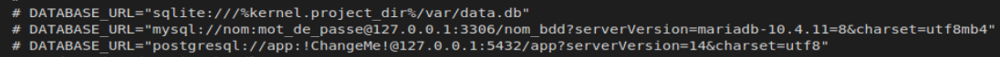

<h1>Projet RPG Symfony</h1>

<h2>Introduction</h2>

Ce projet est la mise en application de Symfony en lien avec la base de donnée pour faire un CRUD (Create, Read, Update, Delete).
  
Le but ici est de pouvoir, en lien avec la base de donnée, créer la fiche d'un personnage pour des jeux de rôles.
  
Ce dernier ce compose d'un nom, une description, une date d'anniversaire, un niveau, des points expériences et des points de vies. 
En plus de cela, cette table est lié à un type, des compétences ainsi qu'un avatar créer via Avataaars.js
  
En plus de pouvoir visualiser notre fiche de personnage, nous pouvons créer un personnage ainsi que des types. Nous pouvons aussi les modifier et les effacer.

<h2>Installation</h2>

Pour installer ce projet il faut tout d'abord cloner ce dépot. Dans votre terminal faite : <code>git clone</code> et rajouter le lien que vous souhaiter entre le SSH, HTTPS ou GitHib CLI trouvable en cliquant sur le bouton vert <code>Code</code>
  
Par la suite, il ne faut pas oublier d'installer les modules manquants en écrivant ceci dans le terminal : <code>composer install</code>.
  
Ensuite il faut modifier le nom du fichier<code>.env.sample</code> en <code>.env</code> et modifier son contenu au niveau des lignes suivantes : 
  </img>  
Dans ce ficher, il faut mettre les informations lié à votre base de données en enlever le commentaire (l'hashtag) selon ce que vous utiliser : sqlite, mysql ou bien postgresql. Les informations seront à completer avec votre nom de compte, votre mot de base ainsi que le nom de la base de donnée que vous voulez créer.
  
De plus, il faut créer la base de donnée en écrivant dans le terminal :  <code>php bin/console doctrine:database:create</code>.
  
Enfin, il faut faire une migration des informations vers cette base de donnée :  <code>php bin/console doctrine:migrations:migrate</code>
  
Le projet est ainsi installer, pour accéder au site, qui tourne localement sur votre ordinateur il faut écrire dans le terminal <code>symfony server:start</code>. Le server ce met en route et pour accéder au site, soit vous cliquer sur le lien donner dans le terminal soit dans votre navigateur vous écriver <code>localhost:8000/</code>.
  
Vous voici arriver sur la page d'accueil ! Laisser vous guider par les boutons et créer vos personnages et vos types.
  
Il est recommandé de créer en premier lieu des types avant la création de personnage pour avoir accès à une réalisation complète de votre fiche de personnage sans passer par la modification.

